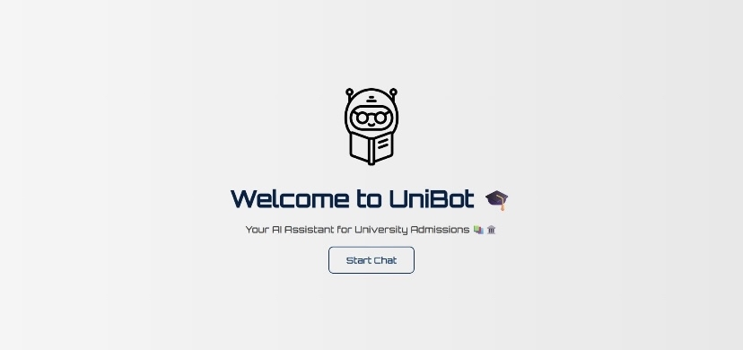
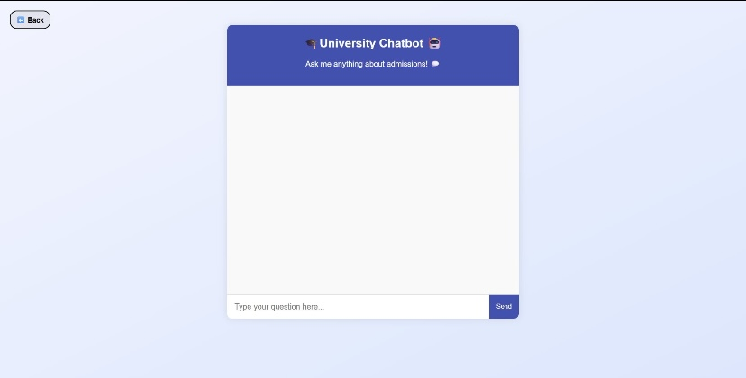
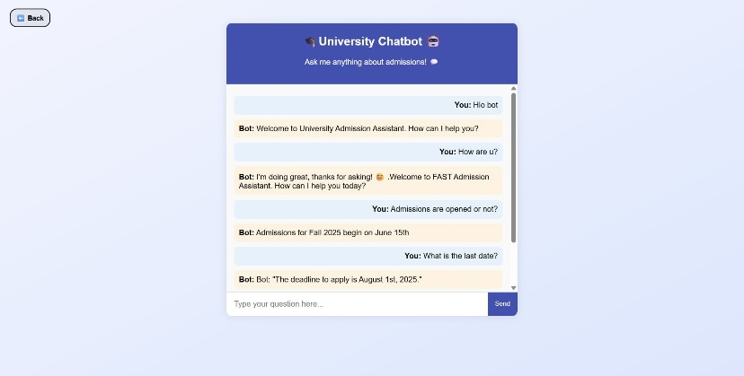

# 📚 University Admission Chatbot using Dialogflow & Django

A **conversational AI assistant** designed to help prospective students with **admissions-related queries**.  
Integrates **Dialogflow NLP** with a **Django web application** to provide real-time answers.

---

## 🎯 Features

- 🤖 **Dialogflow Integration** with Django backend  
- 🎓 Multiple university-specific intents:
  - Admission deadlines  
  - Fee structures  
  - Eligibility  
  - Contact details  
- 🔒 Secure Django webhook for real-time responses  
- 💬 Modern, web-based chat interface  
- 🎨 Customized visuals and emojis for university-themed look  

---

## 🖼️ Visuals

### Home Page
📸 Landing page with a welcoming interface and a **“Start Chat”** button  

### Chatbot Page (Empty)
📸 Chat interface before starting a conversation, showing input box and send button  

### Chatbot Page (With Conversation)
📸 Real-time conversation between a student and the bot, demonstrating university-specific responses  

---

## 📊 Learning Outcomes

- Learned how **Dialogflow handles NLP tasks** to manage complex university-related queries  
- Gained experience **integrating AI services with Django**  
- Explored challenges of **training data quality** for accurate responses  
- Compared effectiveness of **intent-based bots vs advanced LLMs (GPT-4)**  

---

## 🚀 About

This project deepened understanding of building **domain-specific AI solutions** for real-world problems like student admissions.
